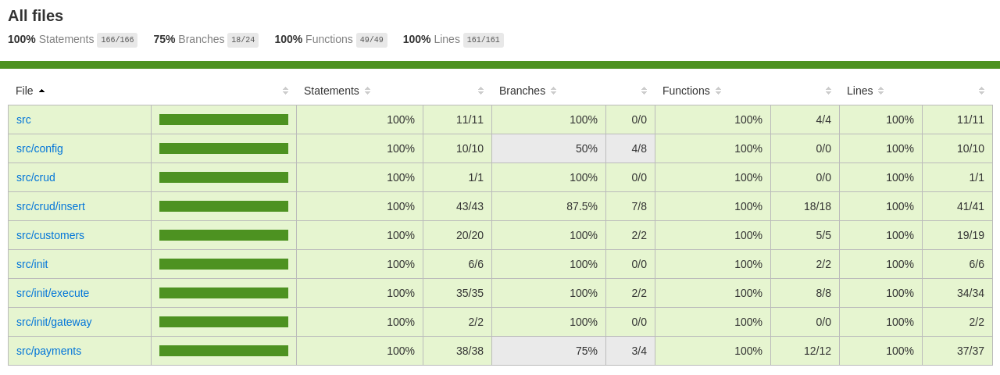

<style>
/* Add total page number */
section::after {
  content: attr(data-marpit-pagination) ' / ' attr(data-marpit-pagination-total);
}
img[alt~="center"] {
    display: block;
    margin: 0 auto;
}
</style>

# Code Coverage

A brief introduction of code coverage, tools, and reports.

---

## Contents

- What is Code Coverage?
- Tools and reporters
- How to read and use the coverage report?
- Conclusion

---

## What is Code Coverage

> Code coverage (a.k.a. test coverage) is a metric that can help you understand how much of your source is tested.

---

## Tools

- `Clover`, `Cobertura`, `JaCoCo` (java)
- `Coverage.py` (python)
- `PHPUnit`, `Xdebug` (php)
- `SimpleCov` (ruby)
- `istanbul` (javascript)
- `mix test --coverage` (elixir)


<!-- image licence: CC0 -->

---

## Reporters


<!-- image credits: Image by rawpixel.com -->

- `clover`
- `cobertura`
- `html`
- `json`, `json-summary`
- `lcov`
- `text`, `text-summary`

---

### Text

```
------------------|----------|----------|----------|----------|----------------|
File              |  % Stmts | % Branch |  % Funcs |  % Lines |Uncovered Lines |
------------------|----------|----------|----------|----------|----------------|
All files         |      100 |       75 |      100 |      100 |                |
  src             |      100 |      100 |      100 |      100 |                |
  errors.ts       |      100 |      100 |      100 |      100 |                |
  test.ts         |      100 |      100 |      100 |      100 |                |
  src/config      |      100 |       50 |      100 |      100 |                |
  index.ts        |      100 |       50 |      100 |      100 |        2,5,6,7 |
  src/crud        |      100 |      100 |      100 |      100 |                |
  index.test.ts   |      100 |      100 |      100 |      100 |                |
  src/crud/insert |      100 |     87.5 |      100 |      100 |                |
  index.test.ts   |      100 |       50 |      100 |      100 |             25 |
  index.ts        |      100 |      100 |      100 |      100 |                |
------------------|----------|----------|----------|----------|----------------|
```

___

### HTML


<!-- image credits: istanbul.js.org -->

---

## The coverage report

- Statements
- Branches
- Functions
- Lines

---

## Conclusion

- Do not simply aim for high coverage
- Monitor coverage increase/deacrease
- Use to find untested code

> Good coverage does not equal good tests


<!-- image credits: martinfowler.com -->

---

## References

<!--
footer: '[![license][license-img]][license-link]'
-->

- [atlassian.com/continuous-delivery/software-testing/code-coverage](https://www.atlassian.com/continuous-delivery/software-testing/code-coverage)
- [martinfowler.com/bliki/TestCoverage.html](https://martinfowler.com/bliki/TestCoverage.html)
- [istanbul.js.org](https://istanbul.js.org)


[license-img]:https://i.creativecommons.org/l/by-nc-sa/4.0/88x31.png
[license-link]: http://creativecommons.org/licenses/by-nc-sa/4.0/

<!-- Presentation created with [Marp](https://marp.app/) -->
