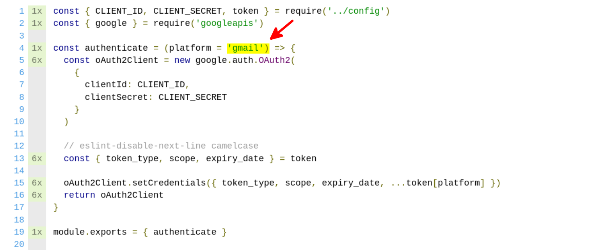

<style>
/* Add total page number */
section::after {
  content: attr(data-marpit-pagination) ' / ' attr(data-marpit-pagination-total);
}

a {
  color: inherit;
  text-decoration: none;
}

img[alt~="center"] {
  display: block;
  margin: 0 auto;
}
</style>

# Code Coverage

`99% ⬆`

A brief introduction of code coverage, tools, and reports.

---

Paulo Diovani Gonçalves

`@paulodiovani`

`linkedin.com/in/paulodiovani`


---

## Contents

- What is Code Coverage?
- Tools and reporters
- How to read and use the coverage report?
- Conclusion
- References

---

## What is Code Coverage

> Code coverage (a.k.a. test coverage) is a metric that can help you understand how much of your source is tested.

---

<!--
_footer: Image by rawpixel.com
-->

## Tools

- `Clover`, `Cobertura`, `JaCoCo` (java)
- `Coverage.py` (python)
- `PHPUnit`, `Xdebug` (php)
- `SimpleCov` (ruby)
- `istanbul` (javascript)
- `mix test --coverage` (elixir)


---

<!--
_footer: Image by rawpixel.com
-->

## Reporters


- `clover`
- `cobertura`
- `html`
- `json`, `json-summary`
- `lcov`
- `text`, `text-summary`

---

<!--
_footer: Image by martinfowler.com
-->

###  What percentage of coverage should I aim for? 

> That is not the point...


---

Monitor coverage is good, but requiring it as a target may lead to bad
tests and false positives.


---

## How to read and use the coverage report

- Statements
  * `const foo = 123`, `someFn()`
- Branches
  * `if (foo === true) {}`, `switch (bar) {}`, `try {} catch (e) {}`
- Functions
  * `function fn() {}`, `const fn = () => {}`
- Lines
  * `...`

---

### Examples using...

- [istanbul.js.org](https://istanbul.js.org)
- [github.com/Codeminer42/marvin-cm42](https://github.com/Codeminer42/marvin-cm42/)

```bash
npx nyc npm test
```

```bash
npx nyc --reporter=html npm test
```

---

#### Text report (default)


---

#### HTML report


---


---


---

```javascript
describe('/lib/retrieveEmail', () => {
  describe('.getEmail', () => {
    context('when there are emails', () => {
      it('read and return the first message', async () => {
        const email = await getEmail({ from: 'foobar@example.com' })

        expect(email).to.eq('foobar')
      })
    })
  })
})
```

---


---

```javascript
describe('/lib/retrieveEmail', () => {
  describe('.getEmail', () => {
    context('when there are emails', () => {
      it('read and return the first message', async () => {
        const email = await getEmail({ from: 'foobar@example.com' })

        expect(email).to.eq('foobar')
      })
    })

    context('when there are no emails', () => {
      it('returns null', async () => {
        gmailMock.users.messages.list.resolves({ data: { messages: null } })

        const email = await getEmail({ from: 'foobar@example.com' })

        expect(email).to.eq(null)
      })
    })
  })
})
```

---


---


---




---

```javascript
describe('/lib/authenticate', () => {
  describe('.authenticate', () => {
    context('when platform is not provided', () => {
      it('authenticate user with google by default', () => {
        const client = authenticate() // call without args

        // expect(client).to.eq(...)
      })
    })
  })
})
```

---


---

## Conclusion

- Do not simply aim for high coverage
- Monitor coverage increase/decrease
- Use to find untested code
- Improve tests, not only coverage

---

## Conclusion

> Good coverage does not equal good tests

---

## References

<!--
_footer: '[![license][license-img]][license-link]'
-->

- [atlassian.com/continuous-delivery/software-testing/code-coverage](https://www.atlassian.com/continuous-delivery/software-testing/code-coverage)
- [martinfowler.com/bliki/TestCoverage.html](https://martinfowler.com/bliki/TestCoverage.html)
- [istanbul.js.org](https://istanbul.js.org)


[license-img]:https://i.creativecommons.org/l/by-nc-sa/4.0/88x31.png
[license-link]: http://creativecommons.org/licenses/by-nc-sa/4.0/

<!-- Presentation created with [Marp](https://marp.app/) -->
